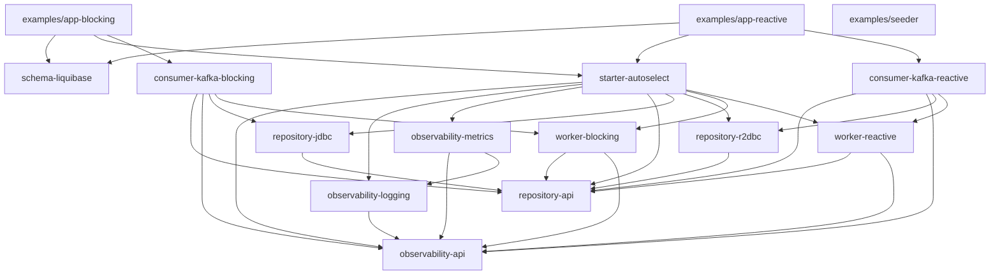

# Architecture

This document is optimized for fast repo navigation by humans and agents.

## Module Map

| Module path | Artifact id | Purpose | Key classes / files |
|---|---|---|---|
| `observability-api` | `superduper-observability-api` | Observer SPI and observation payloads | `SuperduperObserver`, `ObservabilitySettings`, `ConsumerObservation`, `WorkerObservation`, `MaintenanceObservation` |
| `observability-logging` | `superduper-observability-logging` | Logging-based observer implementation | `LoggingSuperduperObserver` |
| `observability-metrics` | `superduper-observability-metrics` | Micrometer-backed observer implementation | `MetricsSuperduperObserver` |
| `repository-api` | `superduper-repository-api` | Storage contracts for ingest, claim, maintenance, and topic-aware factory/registry views | `MessageIngestRepository`, `WorkerMessageRepository`, `ReactiveWorkerMessageRepository`, `WorkerMaintenanceRepository`, `ReactiveWorkerMaintenanceRepository`, `TopicRegistryView`, `TopicRepositoryFactory` |
| `repository-jdbc` | `superduper-repository-jdbc` | JDBC repository implementations and SQL dialects | `JdbcMessageIngestRepository`, `JdbcWorkerMessageRepository`, `JdbcWorkerMaintenanceRepository`, `PostgresJdbcSqlDialect`, `MariaDbJdbcSqlDialect`, `JdbcRepositoryAutoConfiguration` |
| `repository-r2dbc` | `superduper-repository-r2dbc` | R2DBC repository implementations and SQL dialects | `R2dbcMessageIngestRepository`, `R2dbcWorkerMessageRepository`, `R2dbcWorkerMaintenanceRepository`, `PostgresR2dbcSqlDialect`, `MariaDbR2dbcSqlDialect`, `R2dbcRepositoryAutoConfiguration` |
| `worker-blocking` | `superduper-worker-blocking` | Scheduled blocking worker loop, heartbeat, reclaim, cleanup, redrive, and per-topic coordination | `SuperDuperWorkerService`, `TopicWorkerCoordinator`, `TopicWorkerInstance`, `HeartbeatService`, `OrphanReclaimer`, `CleanupService`, `RedriveService`, `QueueHealthService`, `MessageHandler`, `ProcessingResult` |
| `worker-reactive` | `superduper-worker-reactive` | Scheduled reactive worker loop, heartbeat, reclaim, cleanup, redrive, and per-topic coordination | `SuperDuperWorkerReactiveService`, `ReactiveTopicWorkerCoordinator`, `ReactiveTopicWorkerInstance`, `ReactiveHeartbeatService`, `ReactiveOrphanReclaimer`, `ReactiveCleanupService`, `ReactiveRedriveService`, `ReactiveQueueHealthService`, `ReactiveMessageHandler`, `ProcessingResult` |
| `consumer-kafka-blocking` | `superduper-consumer-kafka-blocking` | Spring Kafka consumer that persists records through JDBC repositories | `KafkaConsumerService`, `KafkaConsumerAutoConfiguration` |
| `consumer-kafka-reactive` | `superduper-consumer-kafka-reactive` | Spring Kafka consumer that persists records through R2DBC repositories | `KafkaReactiveR2dbcConsumerService`, `KafkaReactiveR2dbcAutoConfiguration` |
| `starter-autoselect` | `superduper-starter-autoselect` | Auto-selects worker stack and observer backend from properties and resolves topic-aware worker topology | `AutoSelectConfiguration`, `WorkerProperties`, `ObservabilityProperties`, `TopicProperties`, `TopicRegistry`, `RepositoryFactory` |
| `schema-liquibase` | `superduper-schema-liquibase` | Database schema and index changelogs | `db.changelog-infra.yaml`, `db.changelog-master.yaml`, `001-init-infra-postgres.sql`, `001-init-infra-mariadb.sql`, `topic-messages-template-postgres.sql`, `topic-messages-template-mariadb.sql` |
| `examples/app-blocking` | `example-app-blocking` | Runnable JDBC example application | `BlockingExampleApplication`, `ExampleBlockingSeeder`, `ExampleBlockingMessageHandler` |
| `examples/app-reactive` | `example-app-reactive` | Runnable reactive example application | `ReactiveExampleApplication`, `ExampleReactiveSeeder`, `ExampleReactiveMessageHandler` |
| `examples/seeder` | `example-seeder` | One-shot Kafka load generator for multi-container demos | `SeederApplication`, `SeederRunner` |

## Dependency Graph

## Data Flow

1. Kafka records are consumed by `consumer-kafka-blocking` or `consumer-kafka-reactive`.
2. The consumer uses `ConsumerMetadataResolver` to resolve `message_id`, `occurred_at`, `correlation_id`, and `message_type`, then persists the row as `READY` in `messages`.
3. `starter-autoselect` resolves either the legacy single-topic path or the `superduper.topics` registry, then wires `TopicWorkerCoordinator` or `ReactiveTopicWorkerCoordinator` based on `superduper.consumer.type`.
4. Each configured topic gets its own claim loop, handler binding, batch settings, and ShedLock name.
5. The worker enters a short ShedLock-protected claim section and marks eligible rows as `PROCESSING`, including multiple rows for the same key when no row for that key is already `PROCESSING` for that same topic.
6. The worker fetches its claimed rows, processes them per key in `id` order, and invokes the user extension point:
   - blocking: `MessageHandler`
   - reactive: `ReactiveMessageHandler`
7. A handler result updates the row:
   - `SUCCESS` -> `PROCESSED`
   - `FAILURE` -> `FAILED` with incremented retry count, then `STOPPED` once max retries is reached
8. Heartbeat services upsert `container_heartbeats` for active workers.
9. Cleanup, orphan reclaim, queue-health, and redrive services iterate the topic registry and route to the correct shared or dedicated repository instance.

## Extension Points

### Business handlers

- `worker-blocking`: implement `MessageHandler`
- `worker-reactive`: implement `ReactiveMessageHandler`

### Repository ports

- Ingest: `MessageIngestRepository`, `ReactiveMessageIngestRepository`
- Worker claim/process: `WorkerMessageRepository`, `ReactiveWorkerMessageRepository`
- Maintenance: `WorkerMaintenanceRepository`, `ReactiveWorkerMaintenanceRepository`
- Consumer metadata: `ConsumerMetadataResolver`
- Topic-aware wiring: `TopicRegistryView`, `TopicConfigView`, `TopicRepositoryFactory`

These ports isolate service logic from dialect-specific SQL.

### Observer SPI

- SPI: `SuperduperObserver`
- Payload types: `ConsumerObservation`, `WorkerObservation`, `MaintenanceObservation`
- Implementations:
  - `LoggingSuperduperObserver`
  - `MetricsSuperduperObserver`
  - `NoopSuperduperObserver`

## Database Dialect Support

| Concern | PostgreSQL | MariaDB |
|---|---|---|
| infra schema | `001-init-infra-postgres.sql` | `001-init-infra-mariadb.sql` |
| shared messages schema | `topic-messages-template-postgres.sql` (`table.name=messages`) | `topic-messages-template-mariadb.sql` (`table.name=messages`) |
| claim SQL shape | `WITH candidate ... UPDATE ... FROM candidate` | `UPDATE ... JOIN (SELECT ... FOR UPDATE SKIP LOCKED)` |
| row locking primitive | `FOR UPDATE OF m1 SKIP LOCKED` | `FOR UPDATE SKIP LOCKED` in nested candidate query |
| claim indexes | `topic-messages-template-postgres.sql` (bundled with table creation) | `topic-messages-template-mariadb.sql` (bundled with table creation) |

Practical difference:

- PostgreSQL uses a CTE plus `UPDATE ... FROM candidate`.
- MariaDB uses a nested derived table to satisfy `SKIP LOCKED` and `UPDATE JOIN` constraints.
- Both dialects preserve the same behavioral contract: no concurrent ownership, retry-aware claim eligibility, and worker-enforced per-key order inside each batch.

## Multi-Topic Model

- `messages.topic` stores the Kafka topic name, with `"default"` reserved for the backward-compatible single-topic path.
- `TopicRegistry` resolves handler bean name, batch size, max retries, optional dedicated table, and per-topic claim lock name.
- Shared-table topics use the default repositories with `topic = :topic` predicates.
- Dedicated-table topics use repositories created by `RepositoryFactory` / `TopicRepositoryFactory`.
- Maintenance operations are topic-aware too: queue health, reclaim, cleanup, and redrive all route through the same topic registry instead of assuming the shared `messages` table.
