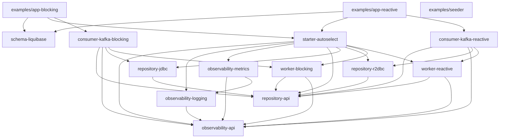

# Architecture

This document is optimized for fast repo navigation by humans and agents.

## Module Map

| Module path | Artifact id | Purpose | Key classes / files |
|---|---|---|---|
| `observability-api` | `superduper-observability-api` | Observer SPI and observation payloads | `SuperduperObserver`, `ObservabilitySettings`, `ConsumerObservation`, `WorkerObservation`, `MaintenanceObservation` |
| `observability-logging` | `superduper-observability-logging` | Logging-based observer implementation | `LoggingSuperduperObserver` |
| `observability-metrics` | `superduper-observability-metrics` | Micrometer-backed observer implementation | `MetricsSuperduperObserver` |
| `repository-api` | `superduper-repository-api` | Storage contracts for ingest, claim, and maintenance | `MessageIngestRepository`, `WorkerMessageRepository`, `ReactiveWorkerMessageRepository`, `WorkerMaintenanceRepository`, `ReactiveWorkerMaintenanceRepository` |
| `repository-jdbc` | `superduper-repository-jdbc` | JDBC repository implementations and SQL dialects | `JdbcMessageIngestRepository`, `JdbcWorkerMessageRepository`, `JdbcWorkerMaintenanceRepository`, `PostgresJdbcSqlDialect`, `MariaDbJdbcSqlDialect`, `JdbcRepositoryAutoConfiguration` |
| `repository-r2dbc` | `superduper-repository-r2dbc` | R2DBC repository implementations and SQL dialects | `R2dbcMessageIngestRepository`, `R2dbcWorkerMessageRepository`, `R2dbcWorkerMaintenanceRepository`, `PostgresR2dbcSqlDialect`, `MariaDbR2dbcSqlDialect`, `R2dbcRepositoryAutoConfiguration` |
| `worker-blocking` | `superduper-worker-blocking` | Scheduled blocking worker loop, heartbeat, orphan reclaim | `SuperDuperWorkerService`, `HeartbeatService`, `OrphanReclaimer`, `MessageHandler`, `ProcessingResult` |
| `worker-reactive` | `superduper-worker-reactive` | Scheduled reactive worker loop, heartbeat, orphan reclaim | `SuperDuperWorkerReactiveService`, `ReactiveHeartbeatService`, `ReactiveOrphanReclaimer`, `ReactiveMessageHandler`, `ProcessingResult` |
| `consumer-kafka-blocking` | `superduper-consumer-kafka-blocking` | Spring Kafka consumer that persists records through JDBC repositories | `KafkaConsumerService`, `KafkaConsumerAutoConfiguration` |
| `consumer-kafka-reactive` | `superduper-consumer-kafka-reactive` | Spring Kafka consumer that persists records through R2DBC repositories | `KafkaReactiveR2dbcConsumerService`, `KafkaReactiveR2dbcAutoConfiguration` |
| `starter-autoselect` | `superduper-starter-autoselect` | Auto-selects worker stack and observer backend from properties | `AutoSelectConfiguration`, `WorkerProperties`, `ObservabilityProperties` |
| `schema-liquibase` | `superduper-schema-liquibase` | Database schema and index changelogs | `db.changelog-master.yaml`, `001-init-schema-postgres.sql`, `001-init-schema-mariadb.sql`, `002-worker-claim-indexes-postgres.sql`, `003-worker-claim-indexes-mariadb.sql` |
| `examples/app-blocking` | `example-app-blocking` | Runnable JDBC example application | `BlockingExampleApplication`, `ExampleBlockingSeeder`, `ExampleBlockingMessageHandler` |
| `examples/app-reactive` | `example-app-reactive` | Runnable reactive example application | `ReactiveExampleApplication`, `ExampleReactiveSeeder`, `ExampleReactiveMessageHandler` |
| `examples/seeder` | `example-seeder` | One-shot Kafka load generator for multi-container demos | `SeederApplication`, `SeederRunner` |

## Dependency Graph

## Data Flow

1. Kafka records are consumed by `consumer-kafka-blocking` or `consumer-kafka-reactive`.
2. The consumer resolves `occurred_at`, derives a deterministic `uuid` from `topic:partition:offset`, and persists the row as `READY` in `messages`.
3. `starter-autoselect` wires either `SuperDuperWorkerService` or `SuperDuperWorkerReactiveService` based on `superduper.consumer.type`.
4. The worker enters a short ShedLock-protected claim section and marks the oldest eligible row per key as `PROCESSING`.
5. The worker fetches its claimed rows and invokes the user extension point:
   - blocking: `MessageHandler`
   - reactive: `ReactiveMessageHandler`
6. A handler result updates the row:
   - `SUCCESS` -> `PROCESSED`
   - `FAILURE` -> `FAILED` with incremented retry count, then `STOPPED` once max retries is reached
7. Heartbeat services upsert `container_heartbeats` for active workers.
8. Orphan reclaimer services reset stale or dead-worker `PROCESSING` rows back to `READY`.

## Extension Points

### Business handlers

- `worker-blocking`: implement `MessageHandler`
- `worker-reactive`: implement `ReactiveMessageHandler`

### Repository ports

- Ingest: `MessageIngestRepository`, `ReactiveMessageIngestRepository`
- Worker claim/process: `WorkerMessageRepository`, `ReactiveWorkerMessageRepository`
- Maintenance: `WorkerMaintenanceRepository`, `ReactiveWorkerMaintenanceRepository`

These ports isolate service logic from dialect-specific SQL.

### Observer SPI

- SPI: `SuperduperObserver`
- Payload types: `ConsumerObservation`, `WorkerObservation`, `MaintenanceObservation`
- Implementations:
  - `LoggingSuperduperObserver`
  - `MetricsSuperduperObserver`
  - `NoopSuperduperObserver`

## Database Dialect Support

| Concern | PostgreSQL | MariaDB |
|---|---|---|
| init schema | `001-init-schema-postgres.sql` | `001-init-schema-mariadb.sql` |
| claim SQL shape | `WITH candidate ... UPDATE ... FROM candidate` | `UPDATE ... JOIN (SELECT ... FOR UPDATE SKIP LOCKED)` |
| row locking primitive | `FOR UPDATE OF m1 SKIP LOCKED` | `FOR UPDATE SKIP LOCKED` in nested candidate query |
| claim indexes | `002-worker-claim-indexes-postgres.sql` | `003-worker-claim-indexes-mariadb.sql` |

Practical difference:

- PostgreSQL uses a CTE plus `UPDATE ... FROM candidate`.
- MariaDB uses a nested derived table to satisfy `SKIP LOCKED` and `UPDATE JOIN` constraints.
- Both dialects preserve the same behavioral contract: oldest eligible row per key, no concurrent ownership, retry-aware claim eligibility.
